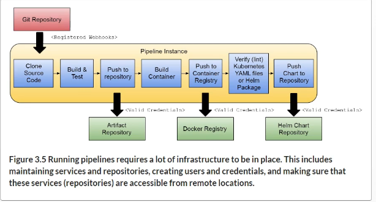

### Chapter 3: Service pipelines: Building cloud-nativea applications

- What does it take to deliver cloud-nataive applictions continuosly

- Conventions that will save you time

 Trunk-based development. 
 Source code and configuration management

- Service pipeline requirements

   Webhooks for source code change notifications

   Artifact repository available and valid credential to push the binary artifact

   Container registry and valid credentials to push new container images

   Helm Chart repository and valid credential.

### Characteristics of GitOps

- Declarative

- Versioned and immutable

- Pulled automatically

- Continuously reconciled

